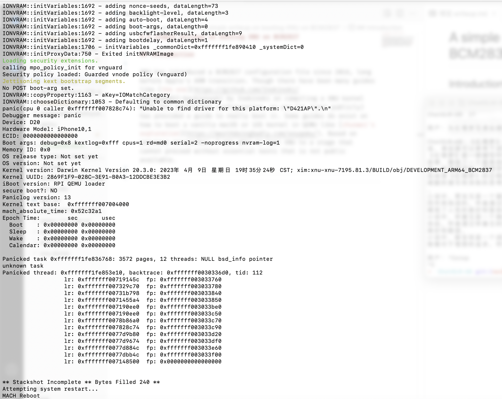

# A simple writeup on booting XNU on BCM2837

## Introduction

XNU has introduced a BCM2837 configuration file since 2016, long before Apple's ARM transition. Though there have been many guides like [the one](https://github.com/Inokinoki/xnu-bcm2837-hackintosh) by Inokinoki on compiling a XNU kernel with this particular configuration, no one (at least publicly) has provided a full guide to really boot it. Some guides do exist on how to boot a vanilla macOS or iOS kernel in QEMU like [zhuowei's exploration](https://worthdoingbadly.com/xnuqemu/). Based on previous researches, I was able to boot XNU to a stage that cannot proceed without essential (`arm64` rather than `arm64e`) kexts that is not public available.



## Environment setup

You may follow [this guide](https://kernelshaman.blogspot.com/2021/02/building-xnu-for-macos-112-intel-apple.html), but **DO REMEMBER to check notes below before proceed**:

1. Replace all `arm64e` with `arm64`
2. Append `OTHERCFLAGS=" -mcpu=cortex-a53 "` to `xcodebuild` command
3. Use `macOS11.1` SDK rather than your current SDK if you are not compiling on macOS11.1 and corresponding Xcode version.

A final command would be like:
```
xcodebuild install -sdk macosx11.1 ARCHS='x86_64 arm64' \
VALID_ARCHS='x86_64 arm64' -target libfirehose_kernel \
PRODUCT_NAME=firehose_kernel DSTROOT=$PWD/dst OTHERCFLAGS=" -mcpu=cortex-a53 "
```

## Mach-O load to QEMU machine

Zhuowei has provided a [QEMU implementation](https://github.com/zhuowei/qemu) that can load XNU kernel(or kernalcache) Mach-O file to QEMU's RAM. As his blog pointed out, we need to load Mach-O file to a base address that leading 1s are erased. For example, data located at (virtual address) `0xfffffff0070059c0` should be loaded to (physical address) `0x70059c0`. In fact, we do not really need to care about this, in zhuowei's QEMU implementation, `hw/arm/boot.c` and `include/macho_loader.h` have provided a good and working implementation even for the latest QEMU. All I need to do is porting these patches to the latest QEMU. As we want to boot XNU on BCM2837(RPI3), we do not need zhuowei's platform related modification as RPI3 is officialy supported by newer QEMU. With reference to zhuowei's boot script, I used mostly this command to boot my XNU:

```sh
./qemu-system-aarch64 -machine raspi3b -cpu max -kernel  /Users/xim/Downloads/kernel.development.bcm2837  -dtb /Users/xim/Documents/rpi-xnu/rpi4.dtb -m 1G -d unimp,int \
        -serial file:/dev/stdout \
        -serial file:/dev/stdout \
        -serial file:/dev/stdout \
        -monitor stdio \
        -append "debug=0x8 kextlog=0xfff cpus=1 rd=md0 serial=2 -noprogress nvram-log=1 " -s -S
```

On real machines, you may need to write such a loader code yourself.

## Device tree

Device tree is commonly used in ARM world, specifying device model, device info and base addresses. ARM version of XNU expects a device tree as one of its boot arguments. Apple uses a device tree format that is different from the one Linux and *BSDs use. I have to find a way to generate one for RPI. Though no complete guide is publicly available, a device tree for XNU on BCM2837 is mentioned in a [twitter post](https://twitter.com/ABradleyUno/status/1307810087864381443?lang=en). Though this particular [device tree](https://github.com/adalric/DeviceTrees/blob/master/BCM2711.json) and [its compiler](https://github.com/adalric/EmbeddedDeviceTrees) is for BCM2711(RPI4), it does work for me on a emulated RPI3.

## XNU build

Initially, I used a precompiled version of XNU from Inokinoki. However, it just crashed right on jumping to an address mapped to virtual addresses. I will put detailed explainations in the next two paragraphs. You may skip if you are not interested.

ARM64 provides two page table root register, `TTBR0` for lower addresses and `TTBR1` for higher addresses. If we want to access an address like `0xfffffff0070059c0`, its address translation will use page table specified by `TTBR1`. For `0x70059c0` case, `TTBR0` is used. Before XNU begins to use virtual addresses, it sets up `TTBR0` and `TTBR1`. `TTBR0` sets a 1:1 map between virtual and physical addresses while `TTBR1` sets a map that `0xfffffff0070059c0` will be translated to `0x70059c0`. Remember that we enter XNU kernel in a physical address? With `TTBR0` set and we still running at physical address, no translation related exception will happen right after we enable MMU. By the way, in the RISC-V Linux implementation, a page fault is triggered right after Linux enables MMU, where Linux has already set its exception handler to the next instruction(but in virtual address). XNU jump to virtual address space after some other initialization is done. XNU loads the **virtual** address of `arm_init()` to a register and jumps to that register.

On newer iPhone and macOS devices, a 16KB page size is used rather than the old good 4KB one. BCM2837, however, expects 4KB page size. Inokinoki compiled BCM2837 config with a macOS configuration while Apple has implicitly set 16KB page size for ARM+macOS combination:
```
# Use ARM_LARGE_MEMORY config for all MacOSX targets.
#ifneq ($(filter $(PLATFORM),MacOSX),)
LARGE_MEMORY_DEFINE=-DARM_LARGE_MEMORY=1
ARM64_PLKSEG_ADDR  =0xfffffe0004004000
ARM64_LINK_ADDR    =0xfffffe0007004000
#endif
```
I have to comment out these to have a working 4KB page size configuration. A recompilation is needed here of course.

## Boot issues

### Priviledge

Firstly, when XNU was unable to jump to virtual addresses, I checked current priviledge level XNU is running on. It turns out to be EL3 which is not what XNU expects (EL1). I commented out EL2 and EL3 support on QEMU RPI3 machine to satisfy XNU. On real machines, you may need to write some bootloader code to lower your priviledge.

### Multicore

Firstly, with vanilla XNU kernel and vanilla QEMU boot process, all four cores starts to run the XNU code right after processor reset. With the issue mentioned above, multiple exceptions are triggered on multi cores. The multicore nature makes it hard to debug. QEMU has its bootloader code encoded as binary. For convinence, I decide to modify XNU startup code and only allow core 0 to boot.

```asm
mrs	x0, mpidr_el1		
	and	x0, x0,#0xFF		// Check processor id
	cbz	x0, master		// Hang for all non-primary CPU
	b	proc_hang

proc_hang: 
	b 	proc_hang

master:
```

### Memory base address assertion

After XNU jumps to virtual addresses, it panics quickly, in the beginning of setting up function of full kernel page tables. It turns out to be, XNU expects both the physical base address and virtual base address to be non-zero:
```
assertf((vm_first_phys != 0) && (vm_last_phys != 0),
	    "Tried setting the Low Globals before pmap_bootstrap()");
```
I have to change the boot arguments to provide a non-zero physical base address.

### UART/AUX access fault

In Inokinoki's XNU build guide, the RPI3 UART and AUX addresss is hardcoded to their physical address. After XNU finishes its virtual memory setup, these addresses are no longer accessible. They should be mapped to virtual address space before use:
```
#ifdef PI3_UART
	//if (SecureDTFindEntry("name", "gpio", &entryP) == kSuccess) {
	//	SecureDTGetProperty(entryP, "reg", (void const **)&reg_prop, &prop_size);
	pi3_gpio_base_vaddr = ml_io_map(pi3_gpio_base_vaddr, 0xA0);
	//}
	//if (SecureDTFindEntry("name", "aux", &entryP) == kSuccess) {
	//	SecureDTGetProperty(entryP, "reg", (void const **)&reg_prop, &prop_size);
	pi3_aux_base_vaddr = ml_io_map(pi3_aux_base_vaddr, 0x70);
	//}
	if ((pi3_gpio_base_vaddr != 0) && (pi3_aux_base_vaddr != 0)) {
		register_serial_functions(&pi3_uart_serial_functions);
	}
#endif /* PI3_UART */
```

### NVRAM setup fault

As zhuowei mentioned in his [newer post](https://worthdoingbadly.com/xnuqemu3/) about booting macOS kernel, a valid NVRAM is needed in device tree. However, the json format is quite not suitable for our need to inject a device tree. Finally I decided to place a `REPLACEME` in json format and patch the dtb with `dd`:
```
strings -t d rpi4.dtb  | grep REPLACE
# output 20452 xxx
# patch from this offset
dd if=XNUQEMUScripts/FourthTry/nvrambin.bin of=rpi4.dtb obs=1 seek=20452 conv=notrunc
# XNUQEMUScripts from zhuowei's GitHub: https://github.com/zhuowei/XNUQEMUScripts
```

There are some other device tree arguments missing in BCM2811.json. I added them according to zhuowei's post and my results.

### Lack of corecrypto kext

After NVRAM initialzation, XNU stucked again in a jump to NULL. I found out it is trying to call a crypto function whose address has not been initialzed. The only function that may initialize this is `register_crypto_functions(const crypto_functions_t funcs)` which has been called by no one. I thought I missed something in my compilation but when I disasseble my running kernel on an Apple Silicon Mac, no caller to this function as well. Finally I found that this should be initialized by `corecrypto.kext`. Apple has restricted its source code usage and vanilla `arm64e` kexts on my Mac cannot work here. After I obtained one copy of its source code, I cannot generate a ARMv8.0 only kext. So I must find another way out. Finally I decided to comment out calls to crypto functions in UUID generation. We are able to proceed, at least temporarily.

With another comment-out in random number generation, we finally reach the point that XNU wants to match a driver for our platform. As I do not have a kext for my platform, our story will have to stop here.

## Conclusion

With reference to guides on booting iOS/macOS XNU kernels, I was able to boot XNU BCM2837 on latest QEMU 7.2.1, to the platform level initialization.
